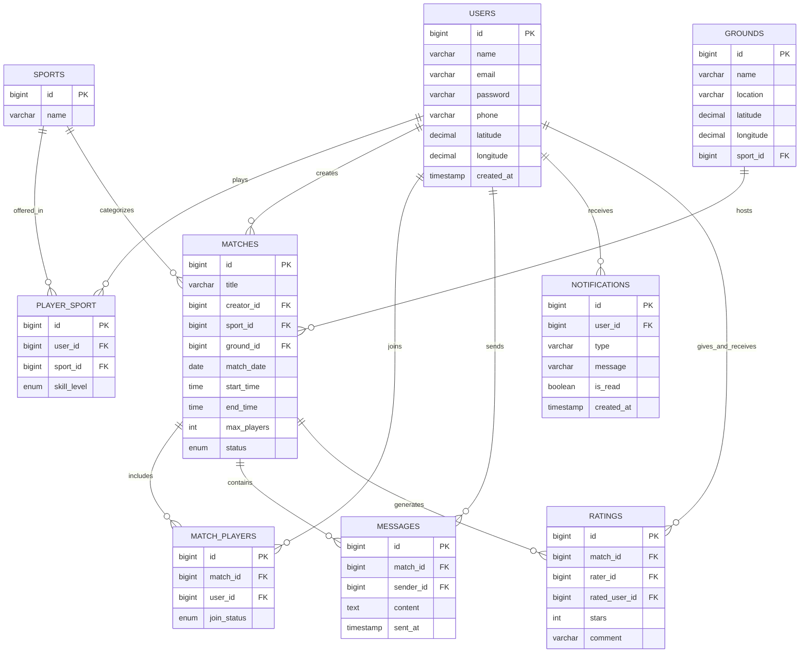

# PlayConnect — Entity Relationship Diagram

**Day 7 Deliverable — Complete Database Design**

## Relationship notes

- **USERS ↔ PLAYER_SPORT ↔ SPORTS** — many-to-many. A user can play multiple sports at different skill levels; a sport has many players.
- **USERS → MATCHES** (creator) — one-to-many. Every match has exactly one creator.
- **GROUNDS → MATCHES** — one-to-many, optional. A match may reference a specific ground, or be `NULL` if the location is just a text description.
- **MATCHES ↔ MATCH_PLAYERS ↔ USERS** — many-to-many with extra attributes (`join_status`), so it's modeled as its own table rather than a plain join table.
- **MATCHES → MESSAGES** — one-to-many. Chat is scoped per match.
- **USERS → NOTIFICATIONS** — one-to-many. Each notification belongs to exactly one recipient.
- **RATINGS** references `users` twice (`rater_id`, `rated_user_id`) — this is why the diagram shows a single relationship line labeled `gives_and_receives` rather than two, to keep the diagram readable; the schema itself has two separate foreign keys.

## Key design decisions

- `ON DELETE CASCADE` is used for dependent data (e.g. deleting a user removes their `player_sport`, `match_players`, `messages`, `notifications`, `ratings` rows) — this avoids orphaned records.
- `ON DELETE RESTRICT` on `matches.sport_id` prevents deleting a sport that has active matches.
- `ON DELETE SET NULL` on `matches.ground_id` and `grounds.sport_id` — losing a ground shouldn't delete the match itself, just its location reference.
- A `CHECK` constraint enforces `stars BETWEEN 1 AND 5` on ratings at the database level, as a safety net beneath whatever validation the Spring Boot service layer does.
